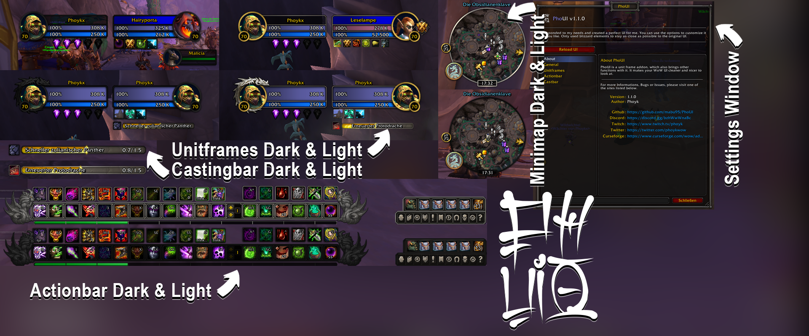

**PhoUI - Dragonflight**

I responded to my needs and created a perfect UI for me. You can use the options to customize it as you like.
Only used blizzard elements to stay as close as possible to the original UI.

**Features**
-   Default Unitframes, but bigger
-   Change Size of Buffs and Debuffs of Target and Focus
-   Darkmode UI
-   Custom Actionbar, Micromenu & Bagbar (+ hidable)
-   Custom Minimap
-   Custom Tooltip

**Bug Reports**
_There will be may some bugs, feel free to report it. I will fix it asap!_
_Write a Ticket_
[https://github.com/mabu95/PhoUI/issues](https://github.com/mabu95/PhoUI/issues)

**Improvements & Wishes**
_Write a Ticket_
[https://github.com/mabu95/PhoUI/issues](https://github.com/mabu95/PhoUI/issues)

**Support**
[Buy me a Coffee](https://www.buymeacoffee.com/mabu95 "Buy me a Coffee")
[Twitch](https://www.twitch.tv/phoyk)
[Twitter](https://twitter.com/phoykwow)
